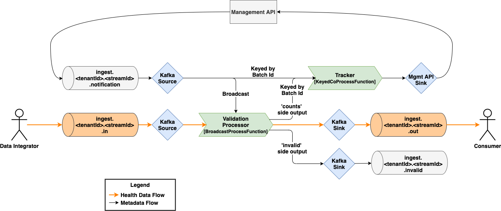

# hri-flink-pipeline-core
This repo contains the Alvearie Health Record Ingestion Flink pipeline processing core library. It defines a Flink stream processing job for validating records as they flow through the HRI, with an interface for the actual validation of records. This enables the creation of validation jobs that are specific to a data type or use-case, while maintaining a consistent processing architecture. Here is a diagram of the logical process graph.

*_This is a draw.io diagram embedded in a png. Use draw.io to make changes._

### Input/Sources
 Records are read from both the `*.in` and `*.notification` Kafka topics. The `*.notification` topic supplies Batch metadata information to the `Validation Processor` and the `Tracker`.

### Validation Processor
The Validation processor stores Batch notification messages in it's broadcast state, which is used for initial checks for every record. It then calls a provided record validator and outputs the record to the valid or invalid downstream Kafka sinks. Additionally, a message is sent to the Tracker indicating if the record is valid.  

Initial record checks:
   * record has `batchId` header
   * `batchId` exists
   * Batch status is not `failed`, `terminated`, or `completed`
   * provided Validator checks record

The Validation processor uses the job parallelism, same as both Kafka sources. It uses a Broadcast state, because the stream of records is not keyed, so every instance needs to know about every batch. Keying the stream by batch id would limit the parallelism to 1 for each batch. The parallelism should be less than or equal to the number of Kafka partitions for the `*.in` topic.

When the validation processor attempts to get a batch by batchId or tenantId, if an HTTP error status code of `404` is returned indicating that the batch ID or tenant ID was not found, a warning message will be logged and the records will be written to the `*.invalid` topic. No other errors will be raised. This is because such an error is likely due to a mistake by a data integrator, and does not warrant a more aggressive failure by the validation processor. If any other HTTP status code in the `400`s (e.g. `400-Bad Request`, `401-Unauthorized`) is returned, the validation will immediately fail. This indicates something is wrong with the HTTP requests, and there is little point in retrying. For any other HTTP error status code, the validation processor will retry for 24 hours, with an exponentially increasing amount of time between each attempt (with a maximum wait time of 5 minutes.)

### Tracker
The Tracker keeps track of every batch's progress and calls the HRI Management API when it is complete or fails. Batches are failed if the number of invalid records reaches the threshold, which is set per batch, or if more records are received then expected. Batches are completed once all the records are received and after a configurable delay. The Batch completion delay is used to wait for any additional records, which would fail the batch. Once the batch is completed, additional records are sent to the invalid topic and do not affect the status of the batch.

Because both Batch notification messages and Validation valid count messages could trigger a Batch status change, both of these input streams have to be keyed by the Batch ID. This ensures that all the messages for a given batch are always processed by the same Tracker instance, which enables it to store the total count and Batch notification together. 

This however does limit the parallelism of the Tracker. Every Batch can only be processed by one Tracker instance. We don't believe this will be a significant performance/throughput bottleneck since the computation is very minimal. Currently, the Tracker's parallelism is set to one quarter of the job's parallelism.

### Output/Sinks
Records that pass validation are written to `*.out` topic. For invalid records, an Invalid record is written to the `*.invalid` topic. The Invalid records contains the error message and a pointer (topic, partition, offset) to the original record, and is defined in the `hri-api-spec` [repo](https://github.com/Alvearie/hri-api-spec/blob/main/notifications/invalidRecord.json). Once a Batch is failed or terminated, the Validation processor stops forwarding valid or invalid records down stream.

The Tracker uses a HRI Management API sink to complete or fail a Batch, which is described above. The sink calls the Batch `processingComplete` or `fail` endpoints respectively. Note that the HRI Management API will write a new Batch notification reflecting the status change to the `*.notification` topic. This creates an external loop in our flow, but is necessary for the Validation processor to pick up these changes. The Tracker keeps additional state about whether it has completed or failed a batch to prevent infinite loops. 

If, when updating a batch as either `processingComplete` or `fail`, the returned HTTP status code is a `409` (Conflict), indicating that the batch is already in the desired state, a warning message will be logged but no other errors will be raised. For all other HTTP status codes in the `400`s (e.g. `400-Bad Request`, `401-Unauthorized`) returned, the attempt to update the status of the batch will immediately fail. This scenario indicates something is wrong with the HTTP requests, and there is little point in retrying. For any other HTTP error status code, the HRI Management API sink will retry the status update for 24 hours, with an exponentially increasing amount of time between each attempt (with a maximum wait time of 5 minutes.)

### Testing
There are three constructors for the Base Validation Job class, one for production and two for testing purposes. One test constructor takes mock sources and sinks for end-to-end unit tests of the entire job. Any changes to the job will require updating and or adding additional end-to-end unit tests to `ValidationJobIntTest.scala`. The other test constructor is for stand-alone integration testing without the HRI Management API. Instead of using the HRI Management API sink, it uses a Kafka sink that writes Batch notification messages directly to the `*.notification` topic. This enables testing error scenarios that are difficult to simulate with the HRI Management API. 

## Integration Testing hri-flink-pipeline-core
In order to fully test your branch of hri-flink-pipeline-core, you must create a branch of a hri-flink-validation repo, set it to point to your branch and run the test on that branch as well.

### Set up the hri-flink-validation branch
First, create and set up your hri-flink-validation branch.  You only have to do this once per hri-flink-pipeline-core branch. The purpose of this set-up is to configure the flink validation code to use your branch of hri-flink-pipeline-core instead of `develop`, so you can verify the integration tests still pass with your changes.

1.  If you haven't already, create a branch in one of the hri-flink-validation repo's, such as `hri-flink-validation-fhir`, and name it the same as this branch.  Check out your new branch.

1.  In the hri-flink-validation branch, find the file `./build.gradle`.  Look for the line similar to `pipelineCoreVersion = 'develop-SNAPSHOT'`. In this line, replace the word `develop` with the name of your branch.  For example, if you are working in the branch `WHFHRI-000`, you would change the line to `pipelineCoreVersion = 'WHFHRI-000-SNAPSHOT'`.

1.  Save, commit and push the changes you just made.

### Test your branch
Next, these are the steps to actively test your work in hri-flink-pipeline-core branch. You may have to go through these steps multiple times.

1.  Make/Fix your changes.

1.  `cd` into this repo, then run  `./gradlew clean build`.  If there are errors, go back to the first step.

1.  Commit your changes and push them to your branch.

1.  Go to GitHub actions and wait for it to rebuild and publish your branch.

1.  For the hri-flink-validation repo you decided to test with in the first section, go to its GitHub actions and re-run the integration tests.  This time they should run using your hri-flink-pipeline-core branch's build.

1.  If all builds pass, your branch is properly tested against the validation library.

### Final Steps
After you pass all the tests, create a PR, have the PR approved, merge/rebase this branch back into develop, and then delete this branch... The very last step is to delete the hri-flink-validation branch you made.

## Releases
Releases are created by creating Git tags, which trigger a GitHub Actions build that publishes a release version in GitHub packages, see [Overall strategy](https://github.com/Alvearie/HRI/wiki/Overall-Project-Branching,-Test,-and-Release-Strategy) for more details.

## Contribution Guide
Please read [CONTRIBUTING.md](CONTRIBUTING.md) for details on our code of conduct, and the process for submitting pull requests to us.

# Communication
Please [join](https://alvearie.io/contributions/requestSlackAccess/) our Slack channel for further questions: `#health-record-ingestion`
Please see recent contributors or [maintainers](MAINTAINERS.md)
